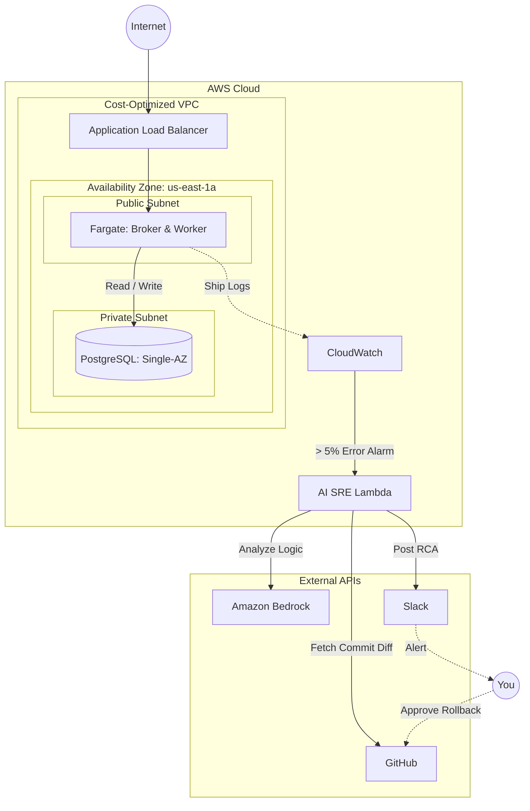

# Aegis

```mermaid
graph TD
    subgraph AWS Cloud
        subgraph Cost-Optimized VPC
            ALB[Application Load Balancer]

            subgraph Availability Zone: us-east-1a
                subgraph Public Subnet
                    FARGATE[Fargate: Broker & Worker]
                end

                subgraph Private Subnet
                    RDS[(PostgreSQL: Single-AZ)]
                end
            end
        end

        CW[CloudWatch]
        LAMBDA[AI SRE Lambda]
    end

    %% Internal Traffic Flow
    Internet((Internet)) --> ALB
    ALB --> FARGATE
    FARGATE -->|Read / Write| RDS

    %% Observability Flow
    FARGATE -.->|Ship Logs| CW
    CW -->|> 5% Error Alarm| LAMBDA

    %% AI Agent Flow
    subgraph External APIs
        GH[GitHub]
        LLM[Amazon Bedrock]
        SLACK[Slack]
    end

    LAMBDA -->|Fetch Commit Diff| GH
    LAMBDA -->|Analyze Logic| LLM
    LAMBDA -->|Post RCA| SLACK
    USER((You)) -.->|Approve Rollback| GH
    SLACK -.->|Alert| USER
```

## Production Screenshot

