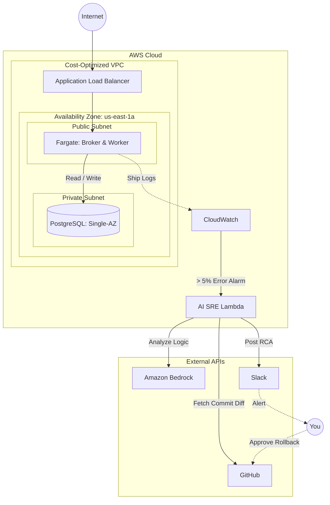

# Aegis 🛡️

> **Autonomous AI-SRE Incident Response & Distributed Task Queue**
>
> 🚧 **Status:** *Under Active Development (Phase 2: Infrastructure as Code)*

---

## 📌 Overview

**Aegis** is a fault-tolerant distributed task queue engineered in **Go** and backed by **PostgreSQL**.

Beyond job queue execution, Aegis features an **autonomous AI SRE Agent** designed for closed-loop incident management. When the application experiences elevated failure rates, the AI engine detects the anomaly via CloudWatch, extracts bad commit context from GitHub, runs root cause analysis (RCA) via Amazon Bedrock LLM, and posts an incident brief to Slack with a one-click human approval for safe rollback.

---

## 🏗️ System Architecture

Aegis is designed for enterprise-grade high availability while offering a cost-optimized deployment model for live portfolio demonstrations.

### 1. Target Enterprise Architecture (Multi-AZ / Production)

*Strict network isolation spanning multiple Availability Zones, private application/data subnets, synchronous database failover, and serverless container compute.*


---

### 2. Cost-Optimized Deployment (Live Portfolio Demo)

*Pragmatic single-AZ configuration running Fargate in public subnets to bypass NAT Gateway overhead ($32/mo) while maintaining private database isolation and the complete AI observability pipeline.*



---

## ⚡ Tech Stack & Architecture Highlights

| Component | Technologies | Engineering Highlights |
| --- | --- | --- |
| **Backend Core** | Go (Golang), PostgreSQL | Concurrent Broker/Worker queue pattern using `FOR UPDATE SKIP LOCKED` for lock-free job distribution. |
| **Infrastructure** | Terraform, AWS ECS Fargate, RDS, ALB, VPC | Declarative Infrastructure-as-Code modularized for clean environment overrides. |
| **Observability** | AWS CloudWatch | Structured log streaming and error rate alarms thresholded at >5%. |
| **AI SRE Agent** | AWS Lambda, Amazon Bedrock, GitHub API, Slack Webhooks | Serverless event-driven RCA generator and human-in-the-loop incident response engine. |

---

## 🛣️ Project Roadmap

* [x] **Phase 1: Backend Task Queue (Go)**
* [x] HTTP Broker API (`/enqueue` job endpoints)
* [x] PostgreSQL state engine with row-level concurrency locking
* [x] Worker polling, exponential backoff, and DLQ handling

* [🔄] **Phase 2: Infrastructure as Code (Terraform)**
* [x] Excalidraw & Mermaid architectural blueprints
* [ ] Multi-AZ VPC module (Subnets, Internet Gateway, Route Tables)
* [ ] ECS Fargate task definitions & ALB routing
* [ ] Managed RDS PostgreSQL provisioning

* [ ] **Phase 3: Autonomous AI SRE Engine**
* [ ] CloudWatch alarm triggering
* [ ] Python/Go Lambda RCA handler (Bedrock + GitHub Context + Slack Webhook)
* [ ] Human-in-the-loop rollback webhook integration

---

## ⚙️ Repository Structure

```text
aegis/
├── .github/workflows/   # CI/CD automation pipelines
├── cmd/
│   ├── broker/          # Entry point for HTTP API Broker
│   └── worker/          # Entry point for Queue Processing Worker
├── internal/            # Application domain logic & DB driver
├── infra/               # Modular Terraform configuration files
└── docs/                # Architecture diagrams and assets

```

---
