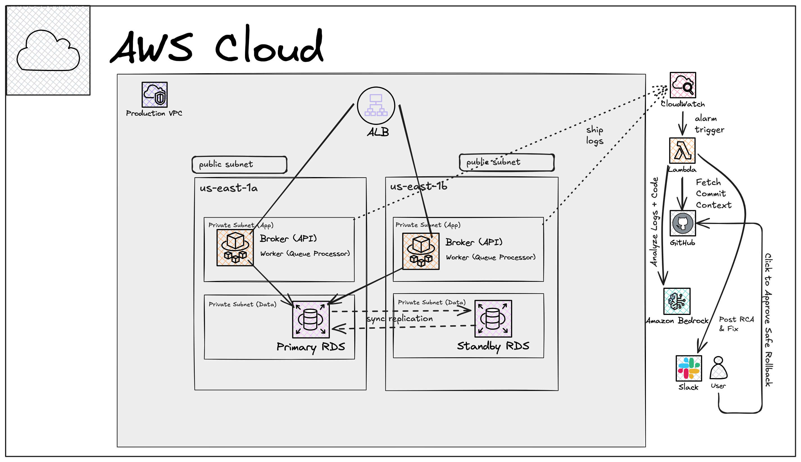
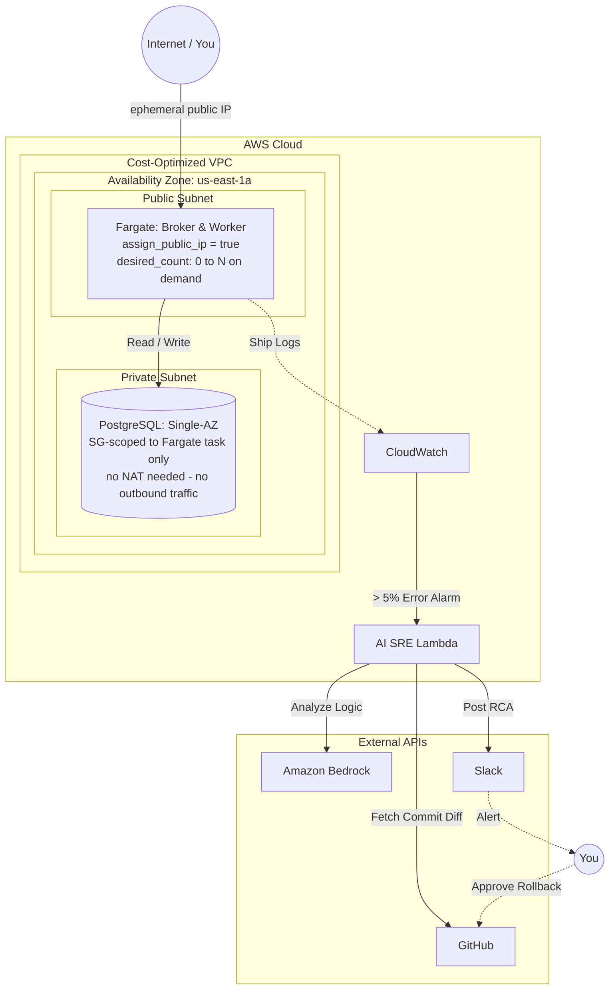

# Aegis 🛡️

> **Autonomous AI-SRE Incident Response & Distributed Task Queue**
>
> 🚧 **Status:** *Under Active Development (Phase 2: Infrastructure as Code)*

---

## 📌 Overview

**Aegis** is a fault-tolerant distributed task queue engineered in **Go** and backed by **PostgreSQL**.

Beyond job queue execution, Aegis features an **autonomous AI SRE Agent** designed for closed-loop incident management. When the application experiences elevated failure rates, the AI engine detects the anomaly via CloudWatch, extracts bad commit context from GitHub, runs root cause analysis (RCA) via Amazon Bedrock LLM, and posts an incident brief to Slack with a one-click human approval for safe rollback.

---

## 🏗️ System Architecture

Aegis is designed for enterprise-grade high availability while offering a cost-optimized deployment model for live portfolio demonstrations.

### 1. Target Enterprise Architecture (Multi-AZ / Production)

*Strict network isolation spanning multiple Availability Zones, private application/data subnets, synchronous database failover, and serverless container compute.*



---

### 2. Cost-Optimized Deployment (Spin-Up-On-Demand Demo)

*Single-AZ real ECS Fargate + RDS, not a simulated substitute — same primitives as the
production tier, sized and scheduled for near-zero idle cost instead of removed. Fargate
tasks run in a **public subnet** with no ALB and no NAT Gateway (both are always-billed
regardless of traffic, ~$16-20/mo and ~$32/mo respectively, with no free tier at any account
age), so the task's security group is the isolation boundary instead of subnet placement.
RDS sits in a genuinely **private subnet** — it never initiates outbound traffic, so it needs
no NAT/egress path at all, meaning it costs nothing extra to keep it off the public internet
entirely, unlike the compute side. `desired_count` scales to 0 between sessions rather than
staying live, so there's no permanent URL — this tier is `apply`'d before a demo and
`destroy`'d (or scaled down) after, targeting pennies per session rather than a 24/7 bill.
RDS `db.t3/t4g.micro` single-AZ is free-tier eligible only on accounts under 12 months old —
verified per-account, not assumed. The AI observability pipeline is unchanged from the target
design.*



---

## ⚡ Tech Stack & Architecture Highlights

| Component | Technologies | Engineering Highlights |
| --- | --- | --- |
| **Backend Core** | Go (Golang), PostgreSQL | Concurrent Broker/Worker queue pattern using `FOR UPDATE SKIP LOCKED` for lock-free job distribution. |
| **Infrastructure** | Terraform, AWS ECS Fargate, RDS, ALB, VPC | Declarative Infrastructure-as-Code modularized for clean environment overrides. |
| **Observability** | AWS CloudWatch | Structured log streaming and error rate alarms thresholded at >5%. |
| **AI SRE Agent** | AWS Lambda, Amazon Bedrock, GitHub API, Slack Webhooks | Serverless event-driven RCA generator and human-in-the-loop incident response engine. |

---

## 🛣️ Project Roadmap

- [x] **Phase 1: Backend Task Queue (Go)**
  - [x] HTTP Broker API (`/enqueue` job endpoints)
  - [x] PostgreSQL state engine with row-level concurrency locking (`SKIP LOCKED`)
  - [x] Worker polling, exponential backoff, and DLQ handling
- [🔄] **Phase 2: Infrastructure as Code (Terraform)**
  - [x] Excalidraw & Mermaid architectural blueprints
  - [ ] AWS Networking module (Multi-AZ capable, deployable as Single-AZ)
  - [ ] ECS Fargate task definitions & ALB routing
  - [ ] Managed RDS PostgreSQL provisioning
- [ ] **Phase 3: Autonomous AI SRE Engine**
  - [ ] CloudWatch metric stream & alarm thresholding (>5% error rate)
  - [ ] Lambda RCA handler (Gemini/Amazon Bedrock + GitHub Commit Context + Slack Webhooks)
  - [ ] Human-in-the-loop rollback approval integration
- [ ] **Phase 4: Chaos Engineering & Failure Injection (Demo Suite)**
  - [ ] **Application-Level:** Poison-pill payloads & synthetic 500 error spikes
  - [ ] **Infrastructure-Level:** ECS Fargate container termination & network latency injection
  - [ ] *(Optional)* **Database-Level:** Connection pool exhaustion & deadlock simulation

---

## ⚙️ Repository Structure

```text
aegis/
├── .github/workflows/   # CI/CD automation pipelines
├── cmd/
│   ├── broker/          # Entry point for HTTP API Broker
│   └── worker/          # Entry point for Queue Processing Worker
├── internal/            # Application domain logic & DB driver
├── infra/               # Modular Terraform configuration files
└── docs/                # Architecture diagrams and assets

```

---
